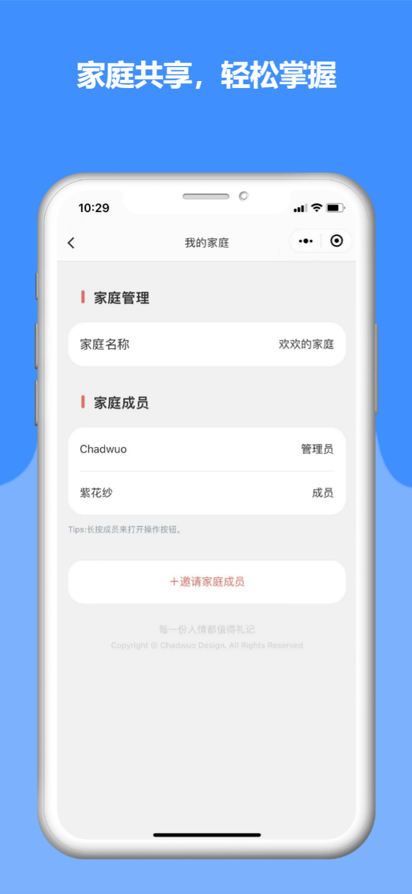

<p align="center">
  <a href="https://github.com/chadwuo/li-ji-weapp">
    
  </a>

  <h3 align="center">礼记</h3>
  <p align="center">
    每一份人情都值得礼记
    <br />
    <a href="https://github.com/Chadwuo/li-ji-weapp/issues/new?template=bug_report.md">报告Bug</a>
    ·
    <a href="https://github.com/Chadwuo/li-ji-weapp/issues/new?template=feature_request.md">提出新特性</a>
  </p>
</p>

  礼尚往来，是中华民族的传统美德，老一辈人一般会在举行宴席的时候用手写人情簿的方式来记录每一个亲友的送礼。这种方式存在很多弊端，比如人情簿丢失、无法携带在身边、很难搜索到某个人的送礼记录、由于手写原因无法辨认清楚内容等等。
  
  「礼记」致力于记录和管理人情来往记录，给你方便快捷的人情记账体验！专业又懂你的人情记账软件，共享记账，全家人共享账本，多维度查询统计人情来往。

---

### 在线体验
 

### 效果图

<table>
  <tr>
    <td></td>
    <td></td>
    <td></td>
    <td></td>
    <td></td>
  </tr>
 </table>

### 文件目录说明

```
li-ji-weapp 
├── LICENSE.txt
├── README.md
├── /miniprogram/--小程序目录
│  ├── /alicloud/--阿里云 Serverless服务
│  ├── /config/--MP-CU配置文件
│  ├── /mp-cu/--ColorUi主框架的文件夹，不建议修改这里面的文件，以免后续升级时，被覆盖。
│  ├── /mp-sdk/--ColorUi框架的辅助文件夹，封装了一些常用的方法函数、扩展图标库等，按需使用，如不需要，可删除此文件夹。
│  ├── /components/--自定义组件
│  ├── /pages/--页面
│  ├── /static/--资源文件
│  ├── /utils/
│  ├── app.js
│  ├── app.json
│  ├── app.wxss

```

### 作者
<table>
    <tbody>
        <tr>
            <td align="center" valign="middle">
                <a href="https://github.com/chadwuo" target="_blank">
                    
                    <div>@chadwuo</div>
                </a>
            </td>
        </tr>
    </tbody>
</table>

### 更新日志

[ChangeLog](https://github.com/chadwuo/li-ji-weapp/releases)

### 版权说明

礼记 使用 GPL-3.0 开源许可协议，在此之前请您务必了解该协议的许可说明以及遵守该协议的法律条件，详情请参阅 [LICENSE.txt](https://github.com/chadwuo/li-ji-weapp/blob/master/LICENSE)。

### 鸣谢

- [MP-CU](https://github.com/Color-UI/MP-CU)：colorUI3.x 微信小程序原生版
- [Vant weapp](https://github.com/youzan/vant-weapp)：轻量、可靠的小程序 UI 组件库
- [wl-pinyin](https://www.npmjs.com/package/wl-pinyin)：汉字转拼音库
- [dayjs](https://github.com/iamkun/dayjs)：Moment.js 的 2kB 轻量化方案，拥有同样强大的 API
- [wx-calendar](https://github.com/lspriv/wx-calendar)：借鉴了MIUI 12日历的部分设计，制作适合微信小程序的日历
- [relationship](https://github.com/mumuy/relationship)：中国亲戚关系计算器
- <s>腾讯云（涨价了，负担不起，已迁移至阿里云）</s>
- [阿里云 Serverless](https://serverless.aliyun.com)：阿里云 Serverless
- [今日诗词 API](https://www.jinrishici.com)：

<!-- links -->
[license-url]: https://github.com/chadwuo/li-ji-weapp/blob/master/LICENSE.txt

