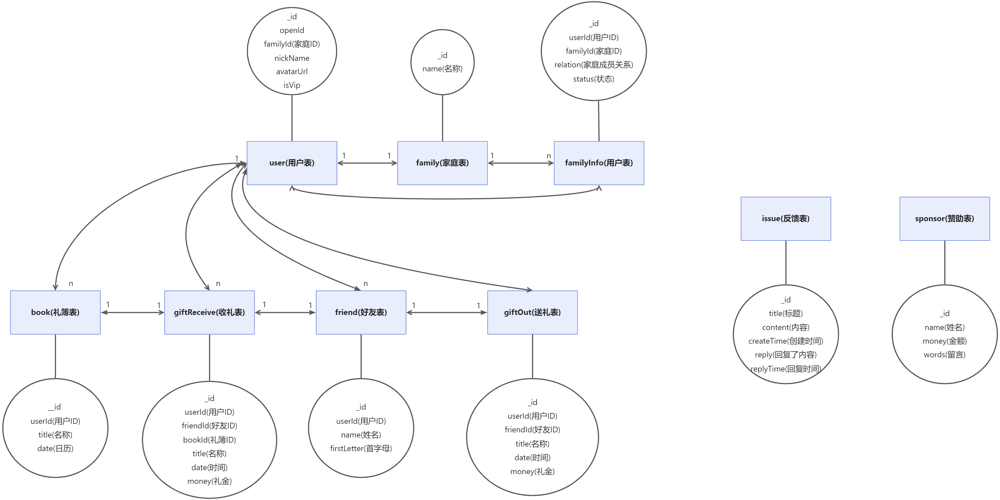

<p align="center">
  <a href="https://github.com/micahh28/li-ji-weapp">
    
  </a>

  <h3 align="center">礼记</h3>
  <p align="center">
    每一份人情都值得礼记
    <br />
    <a href="https://github.com/micahh28/li-ji-weapp/issues">报告Bug</a>
    ·
    <a href="https://github.com/micahh28/li-ji-weapp/issues">提出新特性</a>
  </p>
</p>

  礼尚往来，是中华民族的传统美德，老一辈人一般会在举行宴席的时候用手写人情簿的方式来记录每一个亲友的送礼，然后在对方有宴席邀请的时候翻阅人情簿，计算出送礼金额。这种方式存在很多弊端，比如人情簿丢失、无法携带在身边、很难搜索到某个人的送礼记录、由于手写原因无法辨认清楚内容等等。
  
  「礼记」是一个基于微信小程序的在线人情帐簿，随身携带、快速查找、统计汇总、亲友往来、家庭共享记账，为记账带来了全新体验。

---

### 在线体验
 

### 效果图


### 文件目录说明

```
li-ji-weapp 
├── LICENSE.txt
├── README.md
├── /cloudfunctions/--云函数
├── /miniprogram/--小程序
│  ├── /components/--自定义组件
│  ├── /images/--图片
│  ├── /pages/--页面
│  │  ├── /index/--首页/礼簿
│  │  │  ├── /bookEdit/--编辑礼簿
│  │  │  ├── /bookDetails/--礼簿详情
│  │  ├── /giftReceive/--收礼
│  │  │  ├── /giftReceiveEdit/--编辑收礼
│  │  │  ├── /giftReceiveDetails/--收礼详情
│  │  ├── /giftOut/--送礼
│  │  │  ├── /giftOutEdit/--编辑送礼
│  │  │  ├── /giftOutDetails/--送礼详情
│  │  ├── /profile/--个人中心
│  │  ├── /friends/--联系人
│  │  │  ├── /friendEdit/--编辑联系人
│  │  │  ├── /friendDetails/--联系人详情
│  ├── app.js
│  ├── app.json
│  ├── app.wxss

```

### ER图


### 作者

- [micahh28](https://github.com/micahh28)


### 更新日志

[ChangeLog](https://github.com/micahh28/li-ji-weapp/releases)

### 版权说明

该项目签署了MIT 授权许可，详情请参阅 [LICENSE.txt](https://github.com/micahh28/li-ji-weapp/blob/master/LICENSE)

### 鸣谢

- [Vant weapp](https://github.com/youzan/vant-weapp)：轻量、可靠的小程序 UI 组件库
- [wxmpbarrage](https://github.com/woswk/wxmpbarrage)：小程序弹幕组件

<!-- links -->
[license-url]: https://github.com/micahh28/li-ji-weapp/blob/master/LICENSE.txt

